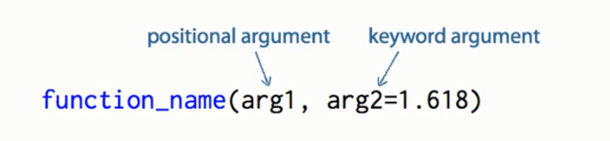
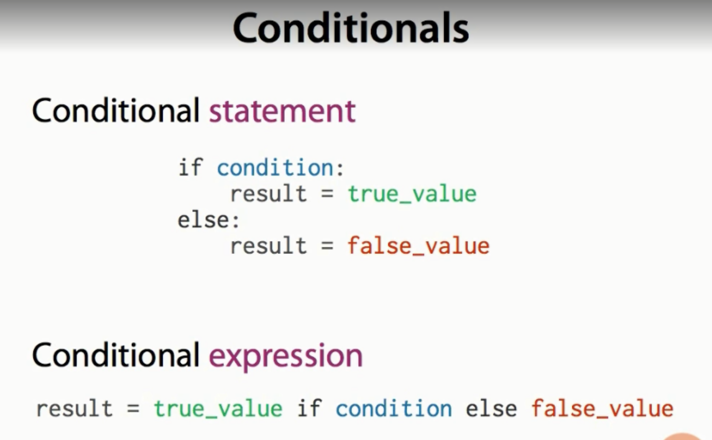
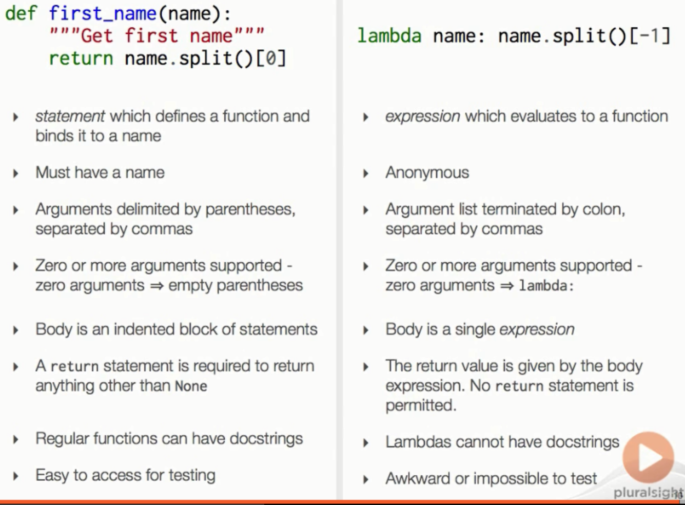

Position Argument and Keyword Argument



The choice that an argument is position or keyword is based on the function call, NOT on function definition

In keyword argument default values are called only once, when the function is called the first time. Hence care should be taken for mutable arguments like lists. 

# __call__()

This is used to make instances callable. 

Without call function

`xyz = Class('bla')`

with call function

```python
xyz = Class()
xyz('bla')
```

# timeit

This can be used to get the time taken to execute the module

In this the entire program is written in the comment section as shown

```python
from timeit import timeit
timeit("""[x for x in range(100) if x%2==0]""",number=10)
0.00011691694476212433
```

In this example the program is not written, but heavy REPL is used. 

```python
>>> from resolver import Resolver
>>> resolver = Resolver() #callable instance
>>> from timeit import timeit
>>> timeit(setup="from __main__ import resolver", stmt="resolver('rekhta.com')",number=1) # the import resolver is the instance name
0.04567123936870205
>>> timeit(setup="from __main__ import resolver", stmt="resolver('rekhta.com')",number=1)
5.354974571325499e-06
>>> print("{:f}".format(_)) # the _ saves the last value and f is for float
0.000005
```
# Conditional Expression



```python
>>> def seq_class(immutable):
...     return tuple if immutable else list
...
>>> seq = seq_class(False)
>>> s = seq('hello')
>>> s
['h', 'e', 'l', 'l', 'o']
>>> type(s)
<class 'list'>
>>> seq = seq_class(True)
>>> s = seq('hello')
>>> s
('h', 'e', 'l', 'l', 'o')
>>> type(s)
<class 'tuple'>ex
```

# lambda

Lambda is used to create a quick function without writing a definition and everything

```python
def last_name(name):
    return name.split()[-1]
```

The above can be written as 

```python
lambda name: name.split()[-1]
```

Sorting by last name

```python
>>> philosophers = ['Immanuel Kant','Bernard Russell','Marcus Arellius','Ahmad Rushd','Hamid Ghazali','Federik Neitzsche']
>>> sorted(philosophers, key= lambda name: name.split()[-1])
['Marcus Arellius', 'Hamid Ghazali', 'Immanuel Kant', 'Federik Neitzsche', 'Ahmad Rushd', 'Bernard Russell']
```



# Transposing Tables

using zip

zip is used to combine two or more list to make them tuples

```python
>>> a = ['Hydrogen','Helium','Lithium','Boron']
>>> b = [1,2,3,4]
>>> c = zip(a,b)
>>> c
<zip object at 0x008CDFA8>
>>> for item in c:
...     print(item)
...
('Hydrogen', 1)
('Helium', 2)
('Lithium', 3)
('Boron', 4)
```

columns to rows tansformation

```python
>>> columns = [a,b,d]
>>> for item in zip(columns[0],columns[1],columns[2]):
...     print(item)
...
('Hydrogen', 1, 'a') # rows
('Helium', 2, 'b')
('Lithium', 3, 'c')
('Boron', 4, 'd')
>>> for col in columns:
...     print(col)
...
['Hydrogen', 'Helium', 'Lithium', 'Boron'] # columns
[1, 2, 3, 4]
['a', 'b', 'c', 'd']
```