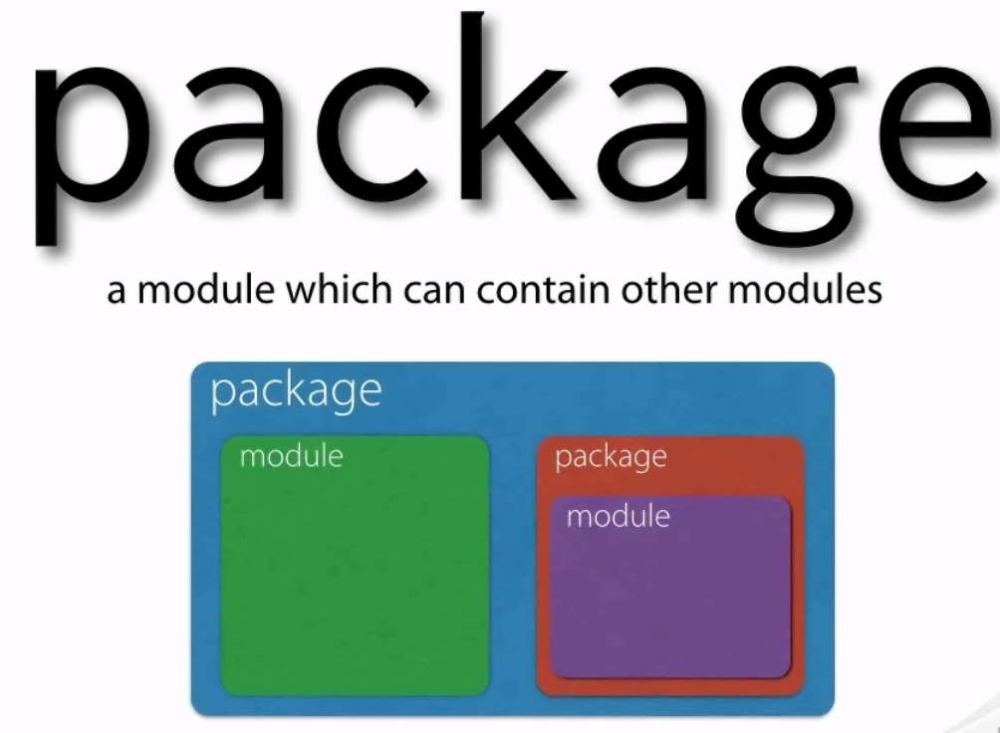
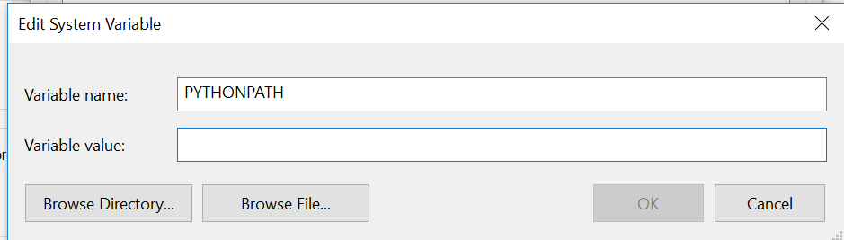
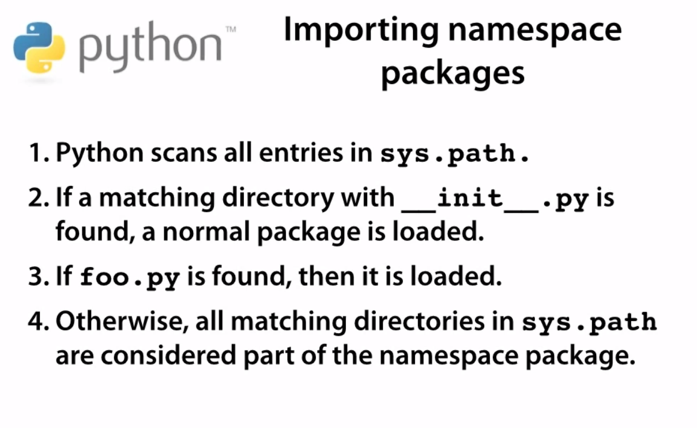

# Packages

* Difference between package and module
Modules are usually files `xyz.py` and packages are at directory level but can also be said for files. 



Both packagge and module are of type module. The package has a dunder method `__path__` where as module doesn't. 

```python
import urllib
type(urllib)
<class 'module'>
import urllib.request
type(urllib.request)
<class 'module'>
dir(urllib) # has __path__
dir(urllib.request) # no __path__ method

help(urllib) #another way to look at the methods, but won't show dunder methods

urllib.__path__ # To find the location of the package
```
How does python locate module?

* Python checks the path variable for the system, sys.path
* For this it uses sys.path which is a list of many paths, starting from empty--meaning local directory. If you are running python from command prompt and not in the directory, add the directory in which module is present to sys.path using append and then you will be able to run the module.The other way to do this is to set PYTHONPATH='<FOLDER>' this will automatically apend the path in sys.path

```python
>>> sys.path
['', 'C:\\Python36\\python36.zip', 'C:\\Python36\\DLLs', 'C:\\Python36\\lib', 'C:\\Python36', 'C:\\Python36\\lib\\site-packages']
```
or just use `sys.path.extend([r'C:\bla'])` and start working
PYTHONPATH



when we open cmd and do sys.path again it will show all the paths in the PYTHONPATH.

From the documentation

https://docs.python.org/3/using/cmdline.html#using-on-envvars

Augment the default search path for module files. The format is the same as the shell’s PATH: one or more directory pathnames separated by os.pathsep (e.g. colons on Unix or semicolons on Windows). Non-existent directories are silently ignored.

In addition to normal directories, individual PYTHONPATH entries may refer to zipfiles containing pure Python modules (in either source or compiled form). Extension modules cannot be imported from zipfiles.

The default search path is installation dependent, but generally begins with prefix/lib/pythonversion (see PYTHONHOME above). It is always appended to PYTHONPATH.

An additional directory will be inserted in the search path in front of PYTHONPATH as described above under Interface options. The search path can be manipulated from within a Python program as the variable sys.path


How to create a package which we can import 

* To make package a module you add a dunder `__init__.py` file to that Package. 
* You make sure that the package is saved in the sys.path directory so it can be accessed with import. 
* This is simply executing the `__init__.py` module, you can test this by addin a print() and it will print it when you import the package
* This way you can import the "folder" and call the methods in the `__init__.py` module
* once you are able to accep the package using import because of the `__init__.py` if you want to access another module in the package you will have to import it. Eg `import reader.axis` where reader is package and axes is a module, you can't do import reader and try to access the axis module. But if you put the content of axis in the `__init__.py` then you can access it from just import reader
```python
reader
    __init__.py

    from reader.axis import Axis

    axis.py
    class Axis:
        
```
With the above setting if we want to use the class Axis we just have to give

```python
import reader
r = reader.Axis()
```

Without the setting in the `__init__.py` we will have to do the following

```python
import reader.axis
r = reader.axis.Axis()
```

* Packages can contain sub-packages which themselves are implemented by `__init.py__` file

```python
reader
    __init.__.py
    writer
        __init__.py

import reader.writer # will work, if we had no int it wouldn't have worked
```

# Relative Import


In the above if you want to go a package up that's parent package you will use `..`

It's best practice to avoid relative Import

# __all__

When we do `from module import *` it will import all modules in our `locals()` space. If we use `__all__` then we can restrict this by specific all the modules we want it to load


# Namespace Packages

* It's package in which packages are split across different directories based on logical divisions.  
* Namespace package doesn't have `__init__.py` this will avoid a complex initialization order
* This was implemented in 2012 in Python
* How does Python find the packages during import if no `__init.py__`?

`import foo`




# Executable directory

How to execute a directory like this `python <directory>` from command line.

By adding a `__main__.py` module to the directory.
These are the one which contains an entry point for Python Execution

# Recommended Project Structure


