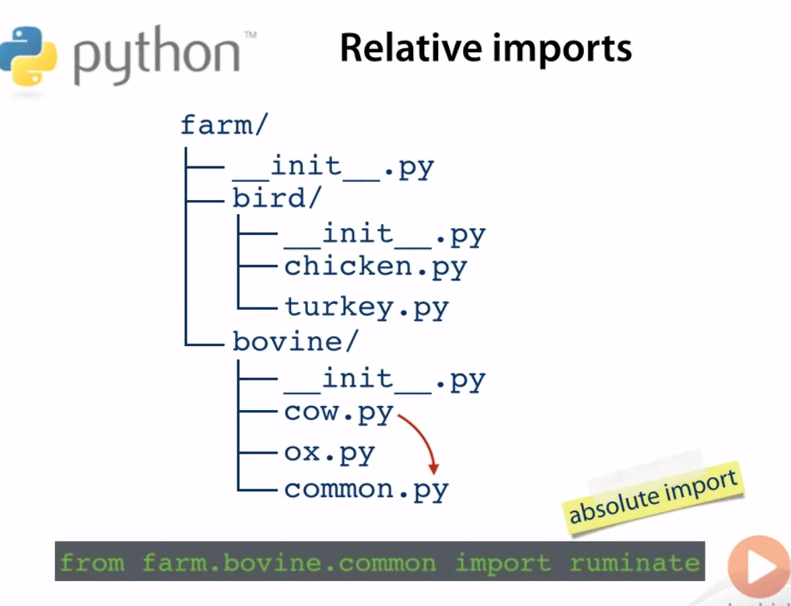
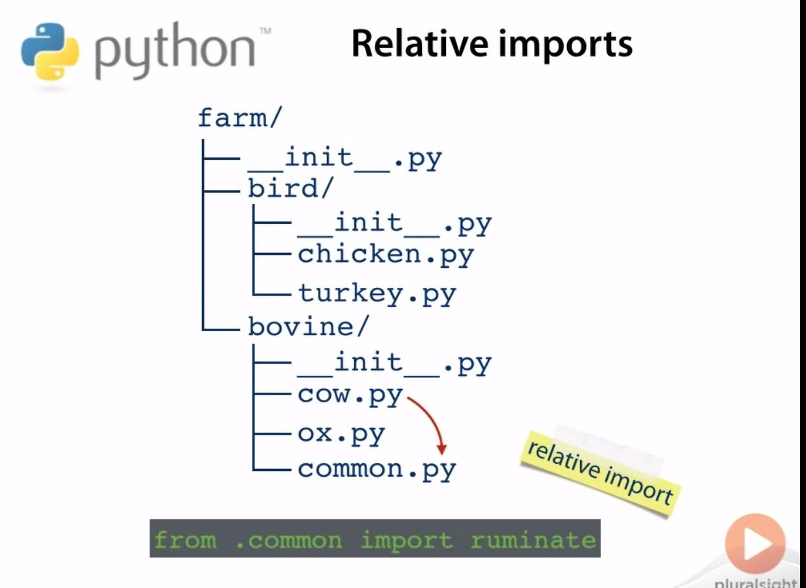
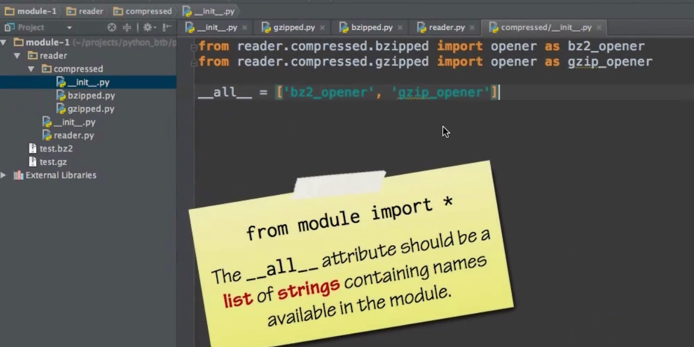
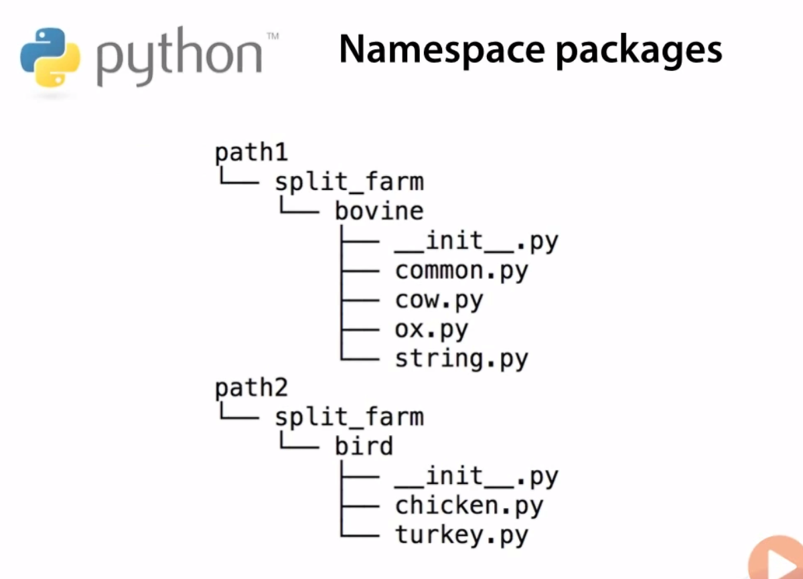
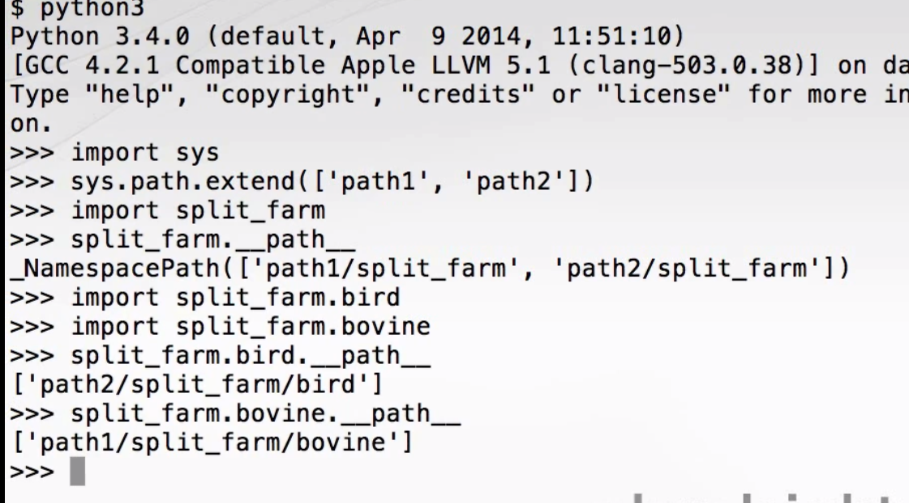
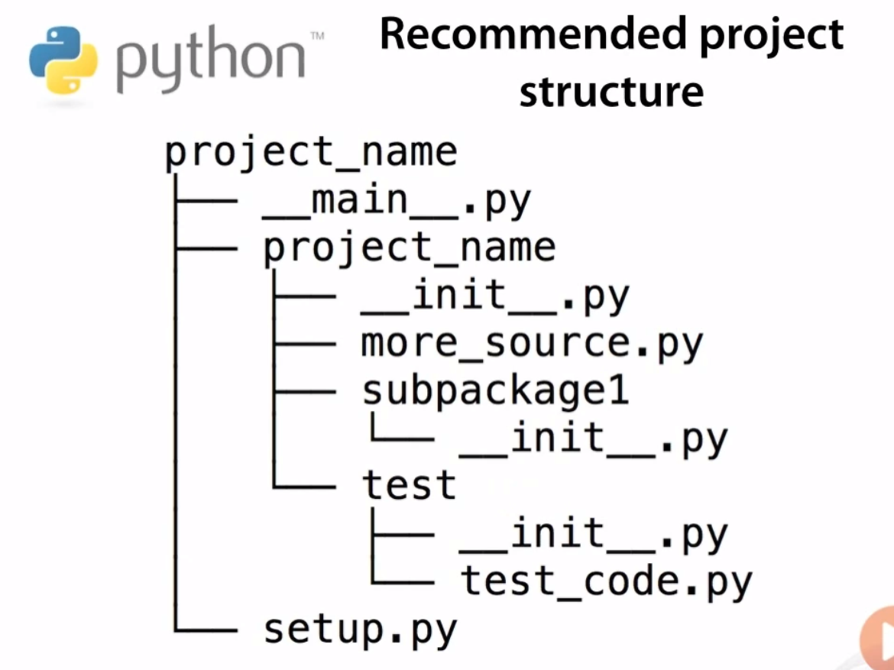
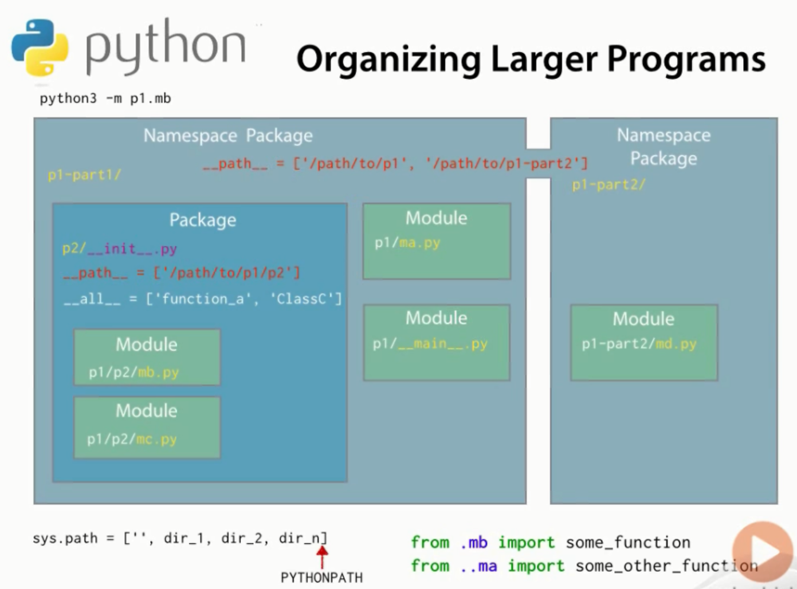

# Packages

* Difference between package and module
Modules are usually files `xyz.py` and packages are at directory level but can also be said for files. 
Both packagge and module are of type module. The package has a dunder method `__path__` where as module doesn't. 
* To make package a module you add a dunder `__init__.py` file to that Package. You make sure that the package is saved in the sys.path directory so it can be accessed with import. This way you can import the "folder" and call the methods in the `__init__.py` module
* When we do import How does python know where to look. For this it uses sys.path which is a list of many paths, starting from empty--meaning local directory. If you are running python from command prompt and not in the directory, add the directory in which module is present to sys.path using append and then you will be able to run the module.The other way to do this is to set PYTHONPATH='<FOLDER>' this will automatically apend the path in sys.path
* once you are able to accep the package using import because of the `__init__.py` if you want to access another module in the package you will have to import it. Eg `import reader.axis` where reader is package and axes is a module, you can't do import reader and try to access the axis module. But if you put the content of axis in the `__init__.py` then you can access it from just import reader
* Packages can contain sub-packages which themselves are implemented by `__init.py__` file

# Relative Import

In the above if you want to go a package up that's parent package you will use `..`

It's best practice to avoid relative Import

# __all__

When we do `from module import *` it will import all modules in our `locals()` space. If we use `__all__` then we can restrict this by specific all the modules we want it to load

# Namespace Packages

* It's package in which packages are split across different directories based on logical divisions.  
* Namespace package doesn't have `__init__.py` this will avoid a complex initialization order
* This was implemented in 2012 in Python
* How does Python find the packages during import if no `__init.py__`?

# Executable directory

These are the one which contains an entry point for Python Execution

# Recommended Project Structure

