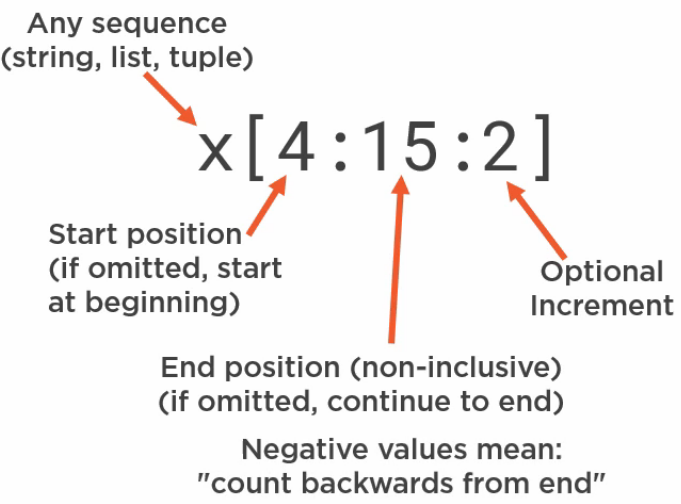

# Python Quick Start for Linux Admin

# Why Python?

* Easy to learn and write
* REPL, can be used interactively
* Powerful built-in data types
    * Strings, integers, floats
    * List, tuple,set, dictionary
* Object-Oriented
    * Many pre-defined classes
* Batteries Included
    * Huge library of moduels
    * Many more in your distro's repo
    * Huge number at Python package index pypi.python.org


# ipython

* ipython3 is REPL+Shell
* sudo apt-get install ipython3
```python
>>>automagic # to turn off, after this u need to give % befor every command
>>>%automagic to turn on
>>>alias findmysyslinks ls -l /etc/ | grep '^l'
>>>run example.py
>>>command(?) will give help
>>>import xyz # to get all modules of xyx just give xyz. and tab
```

# Managing file system with Module

* import os is used to provie a common interface to both Linux and Windows


## OS functions


## Interacting with Linux System

## Slicing

* Extracts part of a sequence to create a new sequence
* Does not modify the original sequence




## Command Line Arguments


optparse

argparse

```python
import argparse

# https://docs.python.org/3/library/argparse.html#module-argparse

parser = argparse.ArgumentParser(description="Process Some integers")
parser.add_argument('integer',
                    metavar='N',  # Optional DISPLAY name , seen in help
                    type=int,
                    nargs='+',  # 1 to n arguments can be passed to integer since it doesn't have -- or - you can give arguments directly
                    help="an integer for an accumulator")
parser.add_argument("--sum",
                    metavar="Sum/max",
                    dest='accumulate',
                    action='store_const',
                    const=sum,
                    default=max,
                    help="sum the integers(default find max)")
args = parser.parse_args()
print(args.accumulate(args.integer))
```

## Accessing the Environment

```python
>>> import os
>>> os.environ
```

## Files Streams and Filters


```python
import sys

print("This is standard output written on stdout")

print("this is written to stderr", file=sys.stderr)

f = open("out1", "w")
print("This is written out1", file=f)
f.close()

with open("out2", "w") as f:
    print("this is written to out2", file=f)

with open("out3", "w") as f:
    sys.stdout = f
    print("This is written in out3")
```

Simple Python program to reverse line by either giving n text files or giving input from command prompt. uses sys.argv and python slicing


```python
import sys

version = 2

if version == 1:  # Boring Loop
    def revline(line):
        outline = ''
        index = len(line)
        while index:
            index -= 1
            outline += line(index)
        print(outline, end='')

if version == 2:  # recursive loop
    def revline(line):
        if line:
            revline(line[1:])
            print(line[0], end='')

if version == 3:  # Pythonic slicing
    def revline(line):
        print(line[::-1], end='')


def process_code(f):
    for line in f:
        revline(line)


if (len(sys.argv)) == 1:
    process_code(sys.stdin)
else:
    for path in sys.argv[1:]:
        try:
            with open(path, "r") as file:
                process_code(file)
        except Exception as e:
            print("Got an exception:{}".format(e), file=sys.stderr)
```

## Signals

Term = Terminate
core = create cores


```python
# time out using sigalarm

import sys
from signal import *


def timeout_handler(signum, frame):  # standard signal method, signumber and frame is signal frame(?)
    raise IOError("User not responding")


def get_name():
    signal(SIGALRM, timeout_handler)  # signal method name
    alarm(5)
    n = sys.stdin.readline()
    alarm(0)
    return n


signal(SIGINT, SIG_IGN)  # CNTRL+Z IGNORED
print("enter your name: ", end='')
sys.stdout.flush()
try:
    name = get_name()
except IOError:
    print("You did not reply, I will call you sleepy")
    name = 'Sleepy'

print("hello {}".format(name))
```

# Combining Python with other tools

## String vs Byte Objects

* Python String is a sequence of unicode characters
* Textual data in Linux is a sequence of bytes

* Everything stored in computer is in the form of bytes
* There are about 256 symbols which have a direct SINGLE byte for them, what about other languages?
* Use two bytes, but that was not enough
* Assign charcters to code points(integers) 1.1M code points, 110k assigned

https://stackoverflow.com/questions/10060411/byte-string-vs-unicode-string-python

```python
>>> a = "foo"
>>> type(a)
<class 'str'>
>>> a = b'foo'
>>> type(a)
<class 'bytes'>
>>> a = r'foo'
>>> type(a)
<class 'str'>
>>> a = b'foo'
>>> type(a)
<class 'bytes'>
>>> a.decode()
'foo'
>>> type(a)
<class 'bytes'>
>>> a = a.decode()
>>> type(a)
<class 'str'>
>>> a = 'foo'
>>> type(a)
<class 'str'>
>>> a = a.encode()
>>> type(a)
<class 'bytes'>
```

## Subprocess

```python
#Demonstrating subprocess printing files > 10k bytes

from subprocess import Popen, PIPE

lister = Popen(["ls", "-l"], stdout=PIPE)

for bytes in lister.stdout:
    line = bytes.decode()
    if line.startswith("total"):
        continue
    spline = line.split()
    if int(spline[4]) > 1000:
        print(spline[8])
```
## Mail


## Sample Program to check disk space in AIX /u01 folder

```py
#! /scs/bin/python3
import subprocess
import argparse
import time

parser = argparse.ArgumentParser()
parser.add_argument('--threshold', '-t', type=int, default=50)
parser.add_argument('--repeat', '-r', action="store_true", default=False)
args = parser.parse_args()

threshold = 50  # default threshold percentage
partition = "/u01"  # default partition

df = subprocess.Popen(["df", "-g"], stdout=subprocess.PIPE)


for line in df.stdout:
    # split into space seperated fields
    splitline = line.split()
    u = splitline[6]
    if u.decode() == partition:
        while True:
            if int(splitline[3][:-1]) > args.threshold:
                print("Warning!, size of /u01 greater than {}%".format(args.threshold))
            if args.repeat:
                time.sleep(5)
            else:
                exit(0)
```

## Open a Tar archive

```py

>>> import tarfile
>>> import os
>>> t = tarfile.open("test.tar","w")
>>> for file in ["out1","out2","out3"]:
...     t.add(file)
...
>>> t.close()
>>> exit()
>>> t = tarfile.open("test.tar")
>>> t.getnames()
['out1', 'out2', 'out3']
>>> t.extractall()

```

```py
# Simple tar program
import sys
import tarfile

if len(sys.argv) > 2:
    list = ["."] # if not files are passed it will archive the directory
else:
    list = sys.arv[1:]

with tarfile.open("temptar.tar", "w") as t:
    for file in list:
        t.add(file)

```

# Manipulating Strings in Python

* Python string is IMMUTABLE sequence of unicode charcters

## format

```py
# Example of specifying field width precision

import math

x = 1
for i in range(10):
    x = x * 2
    y = math.sqrt(x)
    print("{0:4}{1:10}{2:10.4f}".format(i, x, y))
```

## String Test


## Date time

```py
# What day you were born on?

from datetime import datetime

line = input("Enter your DOB in DD/MM/YY format: ")
birthday = datetime.strptime(line, "%d/%m/%Y")
print("You were born on {0:%A}".format(birthday))

```


## Regular Expression

* Used for Input Validation as above, searching and Text substitution

```py
>>> import re
>>> d3 = re.compile(r"[0-9]{3,}") # compiling
>>> re.search(d3, "abc1234xyz")
<_sre.SRE_Match object; span=(3, 7), match='1234'>
>>> re.search(d3, "abc12xyz")
```

Substituting US to UK dates

```py
>>> import re
>>> convertDate = re.compile(r"(\d\d)-(\d\d)-(\d{4})")
>>> us_dates = "11-24-1997, 03-01-2018, 06-28-2010"
>>> uk_dates = re.sub(convertDate, r"\2-\1-\3", us_dates)
>>> uk_dates
'24-11-1997, 01-03-2018, 28-06-2010'
>>> uk_dates = re.sub(convertDate, r"\2-\1-\3", us_dates, count=2)
>>> uk_dates
'24-11-1997, 01-03-2018, 06-28-2010'
```

# Processing Files

## Logging

* Long running background services require logging to file, syslog or systemd journal
  


```py
>>> import logging
WARNING:root:Somethin's wrong?
>>> logging.info("some info") # By default logging level is Warning. To change it exit out of repl and type belo
```

```py
>>> import logging
>>> logging.basicConfig(level = logging.DEBUG, format = "%(levelname)s, %(asctime)s, %(message)s")
>>> logging.warning("this is warning")
WARNING, 2018-08-20 07:30:38,893, this is warning
>>> logging.info("works?")
INFO, 2018-08-20 07:31:07,840, works?
```

## Logging DMO using systemd, standard for Linux

To read from Journal use `Journalctcl | tail`

```py
# Logging Demo

import logging
from systemd.journal import JournalHandler  # Preferred Logging Method - 1 import

# Logging to a file

logging.basicConfig(filename="LogDmo.log", level=logging.DEBUG,
                    format="%(levelname)s %(asctime)s %(message)s")

logging.info("Log Started")

# Logging to systemd journal - 7 steps process
# This can be done with 3 steps. 3, 6, 7. Declare Handler, add handler to log, and write log

jlogger = logging.getLogger("journal-logger")  # 2 log name
jhandler = JournalHandler()  # 3 create handler
jformatter = logging.Formatter(fmt="%(levelname)s %(message)s")  # 4 create formatter
jhandler.setFormatter(jformatter)  # 5 update handler with formatter

jlogger.addHandler(jhandler)  # 6 update logger with handler
jlogger.warning("This is warning sent to the Journal")  # 7 write to log


# To stop updating log LogDmo.log as the above will be written there as well

jlogger.propagate = False
jlogger.warning("warning ONLY the Journal")

# Printing the stack trace with exception handler


def bad_idea():
    try:
        1 / 0
    except:
        logging.error("Failed to divide", exc_info=True)


bad_idea()
```

## Processing an Apache Log

```py
# use log and counting x

import collections

hist = collections.defaultdict(int)  # This is same as dict but will call a int value 0 whenever the key is not available

with open("xyz.log") as file:
    for line in file:
        url = line.split()[6].split('?')[0]
        hist[url] += 1  # regular dict fails at his step if new url is not assigned to 1 already

for url in sorted(hist, key=hist.get, reverse=True):
    if hist[url] < 50:  # ignoring small entries
        break
    print("{0:-40s}: {1:6d}".format(url, hist[url]))
```

# Automatic Updates to /etc/fstab 

```py
# Program to replace device names in /etc/fstab

import re
from subprocess import Popen, PIPE

regex = re.compile(r"(/dev/sd[ab][1-9])(.*)")

outfile = open("fstab.out",mode="w")

for line in open("fstab.in"):
    match = re.search(regex, line)
    if match:
        print("Need to replace {}".format(match.group(1)))
        lsblk = Popen(["lsblk","-n","--output","UIUD",match.group(1)],stdout=PIPE)
        uiud = lsblk.stdout.readline().decode()
        replacement = "UIUD=" + uuid[:-1] + re.sub(regex, r"\2",line)
        print("replacement line is {}".format(replacement))
        print(replacement, end='', file=outfile)
    else: # copy the line through unchanged
        print(line, end='', file=outfile)

outfile.close()
```

# pathlib

https://github.com/snth/pyconza17/blob/master/slides.md

```py
>>> from pathlib import Path
>>> p = Path('.')
>>> p
WindowsPath('.')
>>> p.absolute()
WindowsPath('C:/Users/asyed/Documents/Book/PythonBeyondBasics')
>>> str(p.absolute())
'C:\\Users\\as\\Documents\\Book\\PythonBeyondBasics'
>>> p.absolute().as_uri()
'file:///C:/Users/as/Documents/Book/PythonBeyondBasics'
>>> p.absolute().as_posix()
'C:/Users/asyed/Documents/Book/PythonBeyondBasics'
>>> [x for x in p.iterdir() if x.is_dir()]
[WindowsPath('.git'), WindowsPath('img')]
>>> [str(x) for x in p.iterdir() if x.is_dir()]
>>> [str(x) for x in p.iterdir() if x.is_file()]
['BeyondFunctions.md', 'OrganizingLayerPrograms.md', 'prerequisites.md', 'PythonLinuxAdmin.md', 'README.md']

```

# SysAdmin Course - Linux Academy


## Setting up Centios Server

yum is a package management tools it is used to install softwares easily

* `yum update`
* `yum groupinstall -y "development tools"`
* `yum install -y lsof wget vim-enhanced words which`
* wget = to install softwares 
* which = to see where a program is installed
* lsof = list open files to see which file is open by which process
* vim-enhanced = better version of vim
* words = words is a standard file on all Unix and Unix-like operating systems, and is simply a newline-delimited list of dictionary words. It is used, for instance, by spell-checking programs.

```shell
$ git config --global user.name "Your Name"
$ git config --global user.email "your_email@example.com"
$ curl https://raw.githubusercontent.com/linuxacademy/content-python3-sysadmin/master/helpers/bashrc -o ~/.bashrc
$ curl https://raw.githubusercontent.com/linuxacademy/content-python3-sysadmin/master/helpers/vimrc -o ~/.vimrc
```

* the vimrc is used to edit the vim editor settings. In AIX this will be called ~/.exrc as it uses VI
  
Installing Python and other dependencies
```shell
$ sudo su -
[root] $ yum groupinstall -y "development tools"
[root] $ yum install -y \
  libffi-devel \
  zlib-devel \
  bzip2-devel \
  openssl-devel \
  ncurses-devel \
  sqlite-devel \
  readline-devel \
  tk-devel \
  gdbm-devel \
  db4-devel \
  libpcap-devel \
  xz-devel \
  expat-devel

[root ] $ cd /usr/src
[root ] $ wget http://python.org/ftp/python/3.6.4/Python-3.6.4.tar.xz
[root ] $ tar xf Python-3.6.4.tar.xz
[root ] $ cd Python-3.6.4
[root ] $ ./configure --enable-optimizations
[root ] $ make altinstall # to make sure python which is already installed is not overwritten
[root ] $ exit
$ sudo pip3.6 install --upgrade pip # if problem make sure secure_path in /etc/sudoers file includes /usr/local/bin
```

to run a python file directly that is without using `python foo.py` you need to make `foo.py` executable. Once you make it executable you can fun it as `./foo.py`

Once we’ve written our script, we’ll need to make it executable using `chmod u+x foo.py`


## Standard Library Package

[Documentation](https://docs.python.org/3/library/index.html)

Use time module to create a start stop program

```py
import time

currentTime = time.localtime()

input("Enter any value to stop")

stopTime = time.localtime()

print(f"Program started at {time.strftime('%X',currentTime)}")
print(f"Program stopped at {time.strftime('%X',stopTime)}")
print(f"Seconds Program Running {time.strftime('%H:%M:%S',time.gmtime(time.mktime(stopTime) - time.mktime(currentTime)))}")
```

Use OS package specially `os.environ`

[OS package](https://docs.python.org/3/library/os.html)

Problem with os.environ is that it fails when trying to retrive a environment variable that is not set.

```py
import os

stage = os.environ["STAGE"].upper()

output = f"We're running in {stage}"

if stage.startswith("PROD"):
    output = "DANGER!!! - " + output

print(output)
```

When running the above program if envir variable STAGE is set it works else fails. 

*NOTE: to set environment variable from command prompt use `SETX STAGE XYZ`

To get around this we use `os.getenv`

## Interacting with Files

[Open Documentation](https://docs.python.org/3/library/functions.html#open)

```py
>>> f = open('test.py','r')
>>> type(f)
<class '_io.TextIOWrapper'>
```

Read about the TextIOWrapper

[i/o docmentation](https://docs.python.org/3/library/io.html#io-overview)

cursor position is accessed via `seek`

```py
>>> f.read()
'def helloFunction():\n\tprint("This works")\n\tnum = input("Enter a number")\n\tprint(num)\n\nhelloFunction()'
>>> f.read()
''
>>> f.seek(0)
0
>>> f.read()
'def helloFunction():\n\tprint("This works")\n\tnum = input("Enter a number")\n\tprint(num)\n\nhelloFunction()'
>>> f.seek(7)
7
>>> f.read()
'loFunction():\n\tprint("This works")\n\tnum = input("Enter a number")\n\tprint(num)\n\nhelloFunct
```

To close we need to specifically use `f.close()`

```py
>>> f.close()
>>> f.read()
Traceback (most recent call last):
  File "<stdin>", line 1, in <module>
ValueError: I/O operation on closed file.
```

To avoid this we can use `with open()`

```py
>>> with open('test.py','r') as f:
...     f.read()
...
'def helloFunction():\n\tprint("This works")\n\tnum = input("Enter a number")\n\tprint(num)\n\nhelloFunction()'
>>> f.read() # read/write won't work out of the with loop as file is already closed
Traceback (most recent call last):
  File "<stdin>", line 1, in <module>
ValueError: I/O operation on closed file
```


## Parsing Command Line Parameters

[sys module](https://docs.python.org/3/library/sys.html)

* Positional arguments are based on spaces unless we explicitly wrap the argument in quotes.
* We can get a slice of the first index and after without worrying about it being empty.
* We risk an IndexError if we assume that there will be an argument for a specific position and one isn’t given.

```py
import sys

print(f"Positional arguments: {sys.argv[1:]}")
print(f"First argument: {sys.argv[1]}")
```

```py
$ param_echo testing
Positional arguments: ['testing']
First argument: testing
$ param_echo testing testing12 'another argument'
Positional arguments: ['testing', 'testing12', 'another argument']
First argument: testing
$ param_echo
Positional arguments: []
Traceback (most recent call last):
  File "/home/user/bin/param_echo", line 6, in 
    print(f"First argument: {sys.argv[1]}")
IndexError: list index out of range
```

## argparse

sys.argv is used for simple CL argument extractor. But if we need anything complex we need to use `argparse`

[argparse documentation](https://docs.python.org/3/library/argparse.html)

[Argument Parser Class](https://docs.python.org/3/library/argparse.html#argparse.ArgumentParser)

Basic 3 steps structure

```py
import argparse

parser = argparse.ArgumentParser()  # Step 1 Create parser object
parser.add_argument('filename', help='the file to read')  # step 2 add argument name, -- means optional
args = parser.parse_args()  # step 3 parse args to access them
print(args.filename)

```

when we execute the file

```shell
$ reverse-file -h
usage: reverse-file [-h] filename

positional arguments:
  filename    the file to read

optional arguments:
  -h, --help  show this help message and exit
```

To specify that an argument is a flag, we need to place two hyphens at the beginning of the flag’s name. We’ve used the `type` option for `add_argument` to state that we want the value converted to an integer, and we specified a shorter version of the flag as our second argument. See `###`

```py
import argparse

parser = argparse.ArgumentParser()  
parser.add_argument('filename', help='the file to read')  

parser.add_argument('--limit', '-l', type=int, help='the number of lines to read') ###

args = parser.parse_args() 

print(args)
```
When we run the above

```shell
$ reverse-file --limit 5 testing.txt
Namespace(filename='testing.txt', limit=5)
```

Next, we’ll add a `--version` flag. This one will be a little different because we’re going to use the `action` option to specify a string to print out when this flag is received. This uses a built-in action type of [version](https://docs.python.org/3/library/argparse.html#action) which we’ve found in the documentation

*NOTE: once action is recived the script will not continue with the other execution

```py
import argparse

parser = argparse.ArgumentParser(description='Read a file in reverse')
parser.add_argument('filename', help='the file to read')
parser.add_argument('--version', '-v', action='version', version='%(prog)s 1.0')
parser.add_argument('--limit', '-l', type=int, help='the number of lines to read')
parser.add_argument('--version', '-v', action='version', version='%(prog)s 1.0')

args = parser.parse_args()
print(args)
```
When we execute

```shell
reverse-file --version
reverse-file 1.0
```

Adding business logic

```py
import argparse

# Create Parse
parser = argparse.ArgumentParser(description='Read a file in reverse')
parser.add_argument('filename', help='the file to read')
parser.add_argument('--version', '-v', action='version', version='%(prog)s 1.0')
parser.add_argument('--limit', '-l', type=int, help='the number of lines to read')
parser.add_argument('--version', '-v', action='version', version='%(prog)s 1.0')

# Parse Arguments
args = parser.parse_args()

# Business Logic
with open(args.filename) as f:
    lines = f.readlines()  # return individual lines as a list
    lines.reverse()  # reversing the list

    if args.limit:
        lines = lines[:args.limit]

    for line in lines:
        print(line.strip()[::-1])  # strip to get rid of /n
```

The above program is good but will fail if file doesn't exist for this we will add a `try/except/else/finally`

[try statement](https://docs.python.org/3/reference/compound_stmts.html#the-try-statement)

```py

#Business Logic with try

try:
    f = open(args.filename)  # breaking with
    limit = args.limit
except FileNotFoundError as err:
    print(f"Error: {err}")
else:
    with f:
        lines = f.readlines()
        lines.reverse()

        if limit:
            lines = lines[:limit]

        for line in lines:
            print(line.strip()[::-1])a
```


## TODO ( 2 hr 30 mins)

## Exit Statuses

5 mins
## Execute Shell commands with Python
20
## Advanced Iteration with list Comprehension
10 

## Useful Standard Library Packages

1 hr

## Excercise and Quiz

1 hr


