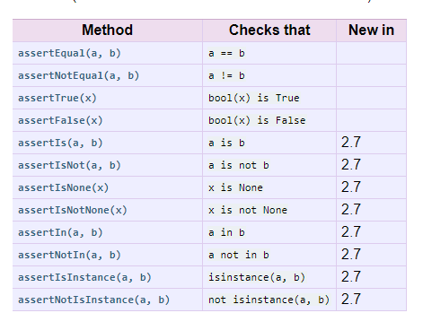

# Pre-Requisites

* Working Python Environment Minimum need Python3
* Defining Functions, Passing arguments, Returning Values

## What are  position arguments, default arguments,keyword arguments, *args and **kwargs

* Position argumens are simply arguments the values are passed by position
* keyword argument are same arguments like above but values are passed with the name or keyword, so the position does not matter
* default argument are those in which there is a default value for the argument which is taken when no value is passed
* `*args` are seen as a tuple where we can pass any number of values. You would use `*args` when you are not sure how many arguments might be passed to your function, i.e. it allows you to pass an arbitrary number of arguments to your function.
* If both `*args` and `**kargs` arguments are present then the format is 
```python
    def function(arg1, arg2, *args, kwarg1, kwarg2, **kwarg)

    
    >>> def print_everything(*args):
        for count, thing in enumerate(args):
    ...         print( '{0}. {1}'.format(count, thing))
    ...
    >>> print_everything('apple', 'banana', 'cabbage')
    1. apple
    2. banana
    3. cabbage
```

* `**kwargs` are dictionary arguments where we can pass any number of named arguments which we haven't defined before

    ```python
    >>> def table_things(**kwargs):
    ...     for name, value in kwargs.items():
    ...         print( '{0} = {1}'.format(name, value))
    ...
    >>> table_things(apple = 'fruit', cabbage = 'vegetable')
    cabbage = vegetable
    apple = fruit
    ```

* You can also use the `*` and `**` syntax when calling a function. For example
    
    ```python
    >>> def print_three_things(a, b, c):
    ...     print( 'a = {0}, b = {1}, c = {2}'.format(a,b,c))
    ...
    >>> mylist = ['aardvark', 'baboon', 'cat']
    >>> print_three_things(*mylist)
    a = aardvark, b = baboon, c = cat
    ```

* Be able to work with basic single file modules(programs) in python. Creating importing and executing

    * There are two ways to execute the python, either the script directly or import it and access the functions. 
    * For creating a module we create a simple script and save it as `.py`. We can run this simple script by going to command prompt and typing `python name.py`.
    *  When we want to make it import usable we have to wrap the main tasks in the `if __name__ == "__main__"` this will avoid running the entire program when we import it. 

* Built-in types. int, float, str, list, dict and set
    
* int

```python
>>> int(2)
2
>>> int(2.2)
2
>>> int('hello')
Traceback (most recent call last):
  File "<stdin>", line 1, in <module>
ValueError: invalid literal for int() with base 10: 'hello'
```

* float

```python
>>> float(2.2)
2.2
>>> float(1.3456789)
1.3456789
```

* str
```python
>>> str('hello')
'hello'
>>> str(123)
'123'
>>> str([1,2,3])
'[1, 2, 3]'
```
* list
```python
>>> a = [1,2,3,'hello']
>>> type(a)
<class 'list'>
>>> s = 'hello'
>>> type(s)
<class 'str'>
>>> b = list(s)
>>> b
['h', 'e', 'l', 'l', 'o']
```
* dict
```python
>>> dicti = {'Hello':123, 'World':456}
>>> for key, items in dicti.items():
...     print( '{0} = {1}'.format(key, items))
...
Hello = 123
World = 456
```
* set
    *  set is used to get a list of unique items. The syntax is `{}`
    *  set is used to filter a list of repeating items
    *  since `{}` is also a dictionary we give `a = set()` to define an empty set
```python
>>> a_set = {1,1,2,3}
>>> a_set
{1, 2, 3}
>>> a_list = [1,1,2,3,4,1,2,3]
>>> a_list
[1, 1, 2, 3, 4, 1, 2, 3]
>>> b_set = set(a_list)
>>> b_set
{1, 2, 3, 4}
>>> a_set = {}
>>> type(a_set)
<class 'dict'>
>>> a_set = set()
>>> type(a_set)
<class 'set'>
>>> a_set
set()
```
* Python single inheritance

    When you inherit from one class, using super()
```python
class PrintSquare():
    def printa(self, value):
        print(value * value)


class DoNothing(PrintSquare):
    def printb(self, value):
        super().printa(value)


b = DoNothing()
b.printb(5)
```
    
`super()` is usually used while initializing

Example without `super()`. As seen below `super()` is not needed if we don't want to initizalize any new variable

```python
class Employee:

    raise_amt = 1.04  # Class Variable

    def __init__(self, first, last, pay):
        self.first = first
        self.last = last
        self.email = self.first + '.' + self.last + '@email.com'
        self.pay = pay

    def fullname(self):
        return '{} {}'.format(self.first, self.last)

    def apply_raise(self):
        self.pay = int(self.pay * self.raise_amt)


class Developer(Employee):
    pass

dev_1 = Developer('Ninja', 'Rock', 65000)

print(dev_1.pay)
dev_1.apply_raise()
print('{} {}'.format(dev_1.fullname(), dev_1.pay))

```

If we want to intialize then the example is shown below. One another thing which is mentioned here is the class variable. Class value can be overwritten as shown

```python
class Employee:

    raise_amt = 1.04  # Class Variable

    def __init__(self, first, last, pay):
        self.first = first
        self.last = last
        self.email = self.first + '.' + self.last + '@email.com'
        self.pay = pay

    def fullname(self):
        return '{} {}'.format(self.first, self.last)

    def apply_raise(self):
        self.pay = int(self.pay * self.raise_amt)


class Developer(Employee):
    pass


class Lawyer(Employee):
    raise_amt = 2.0


class HR(Employee):
    def __init__(self, first, last, pay, school):
        super().__init__(first, last, pay)
        self.school = school

law_1 = Lawyer('Mojo', 'Birla', 10000)
print('{} {}'.format(law_1.fullname(), law_1.pay))
law_1.apply_raise()
print('{} {}'.format(law_1.fullname(), law_1.pay))

Mojo Birla 10000
Mojo Birla 20000
[Finished in 0.2s]

```

* Instance attributes and Class attributes

    Class attributes are owned by class itself and instance attributes are owned by instances of the class. 

    ```python
    >>> class A:
    ...     a = "I am a class attribute!"
    ... 
    >>> x = A()
    >>> y = A()
    >>> x.a = "This creates a new instance attribute for x!"
    >>> y.a
    'I am a class attribute!'
    >>> A.a
    'I am a class attribute!'
    >>> A.a = "This is changing the class attribute 'a'!"
    >>> A.a
    "This is changing the class attribute 'a'!"
    >>> y.a
    "This is changing the class attribute 'a'!"
    >>> # but x.a is still the previously created instance variable:
    ... 
    >>> x.a
    'This creates a new instance attribute for x!'
    >>> 
    ```

* Raising and handling exception Raising Exceptions, Catching Exceptions, Finally, defining your own exception

example without exception

```python
print(1/0)

ZeroDivisionError: division by zero

```

example with exception

```python
try:
    1 / 0
except Exception as e:
    print(e)
division by zero
[Finished in 0.3s]
```

* Iterables and iterators. For-loop, next function, 
* Classes with methods
* Reading and writing text files and binary files
* unittest and debugging

The `.` indicates the number of test passed
```python
practice.py
def add(x, y):
    """Add function"""
    return x + y

practice_test.py
import unittest
import practice


class TestCalc(unittest.TestCase):

    def test_add(self):
        result = practice.add(8, 9)
        self.assertEqual(result, 17)


if __name__ == "__main__":
    unittest.main()

.
----------------------------------------------------------------------
Ran 1 test in 0.001s

OK
[Finished in 0.6s]

```




* special methods, double underscore methods aka dunder method `__<method name>__`

[Youtube Tutorial](https://www.youtube.com/watch?v=3ohzBxoFHAY)